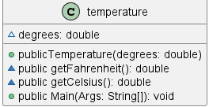
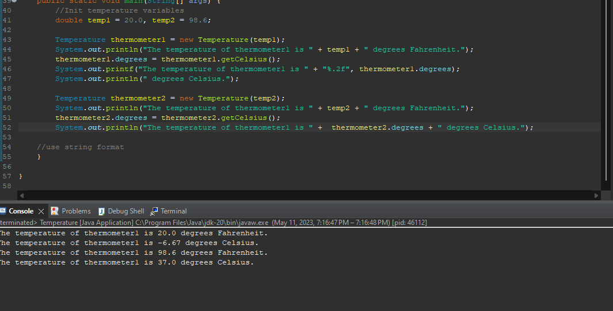

# Temperature report
Author: Braden Tink

## UML class diagram

## Specification
- Have a Class called temperature 
	- Temperature constructor takes in a double as an argument 
	- Temperature Class has two public methods getFerinheit, getCelsius
		- Classes will then convert the argument temperature into the
		  correct unit
	

## Execution and Testing

# Reflection
- Found the assignment helped with understanding methods and objects. I would change the assignment so the user needs to select a base unit before the program is started so that a conversion would need to be held in the getFerinhiet method instead of no conversion as its already in the right base unit. 