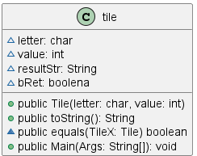
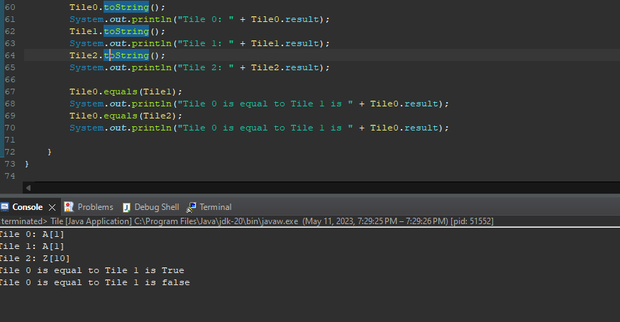

# Tile report
Author: Braden Tink

## UML class diagram

## Specification
 - Have a Class called Tile 
	- Tile constructor takes in two arguments a char and integer as an argument 
	- Temperature Class has two public methods toString(), equals()
		- toString grabs the two arguments to out letter[value] format
		- equals compares the Tile object against another tile object to see if the objects are 		equal

## Execution and Testing

# Reflection
- Had troubles starting the program however it was a good task as it show you how to pass in a object into a method. I could see this being used quite frequently in this course. 
