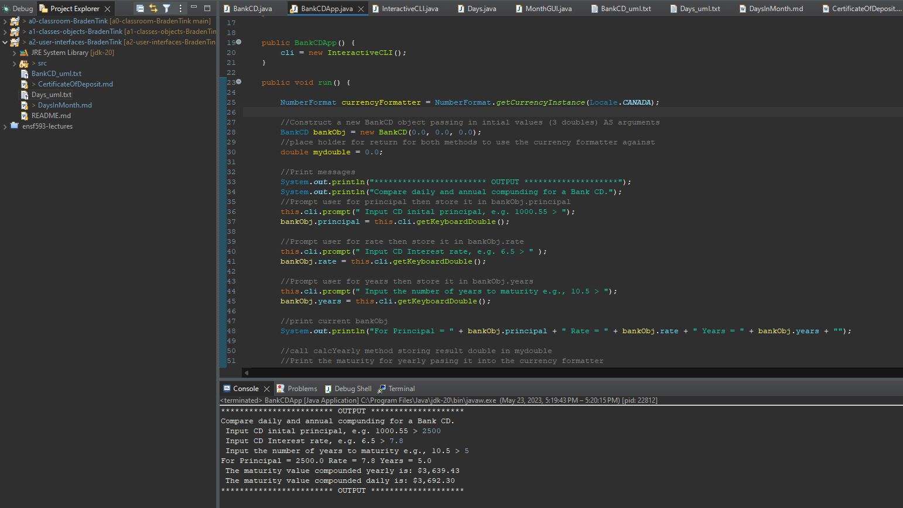

# Days in Month report
Author: Braden

## UML class diagram

## Execution and Testing

# Reflection
Found this assignment tricky getting the correct output as you are taking in user values,
formating values before diplaying it all. Found it was good assignment for understanding what is getting outputted to the console.  