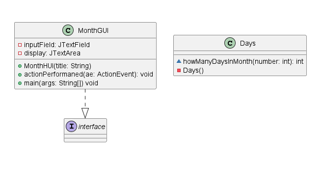
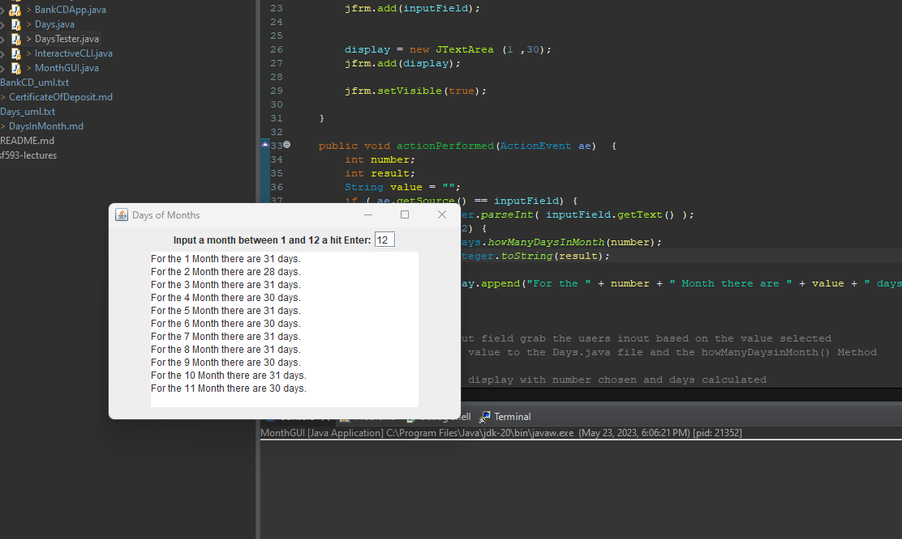

# Days in Month report
Author: Braden

## UML class diagram

## Execution and Testing
**Testing `Days` class**

**Days in Month GUI Usage**

# Reflection
I liked how assignment this assignment used a GUI to take in user input. I think to add to this assignemnt the user should have to show the month in its name not its corisponding value