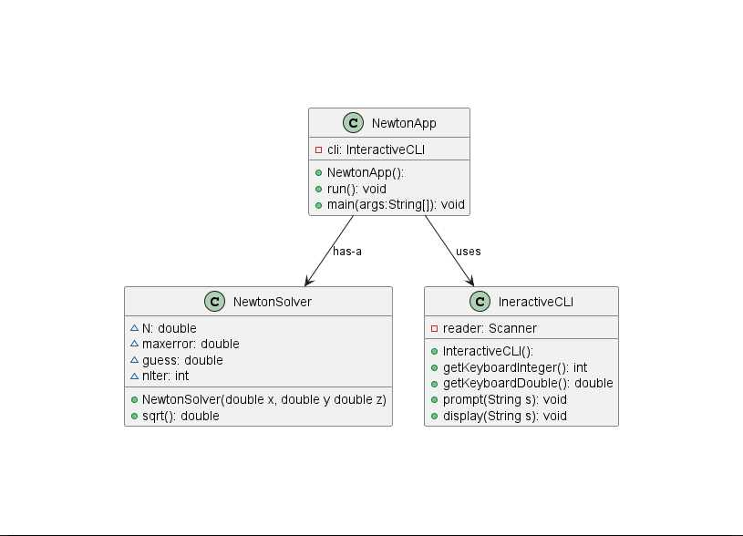
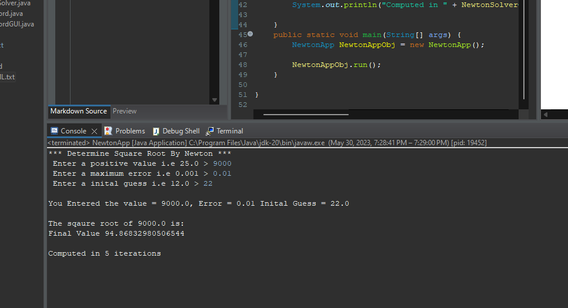
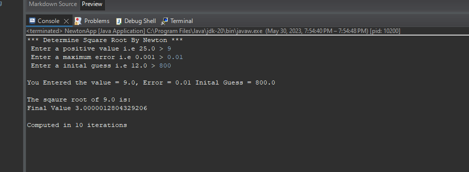
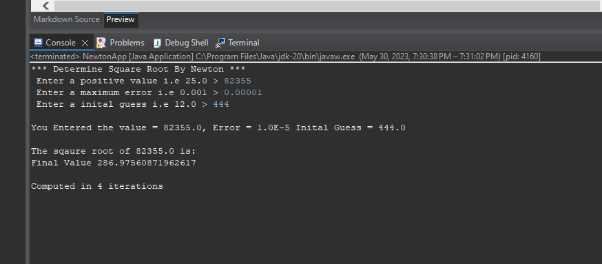

# Newton report
Braden Tink

## UML class diagram

## Execution and Testing
Screenshot demonstrating successful execution and outputs for at least 3 numbers. 

Explain why you chose these numbers for your test.
For the first test I choose a starting number that was greater than the intial guess. This shows the program working correctly in a normal use case.

For the second test I chose a smaller value than what my intial guess was. This tests even if the user misunderstands the purpose of the program it still gives the corret answer

For the last case I used a larger intial value and then a very small maximum error. This test how close the fuction can get to the true value of the squareroot of the number. 

