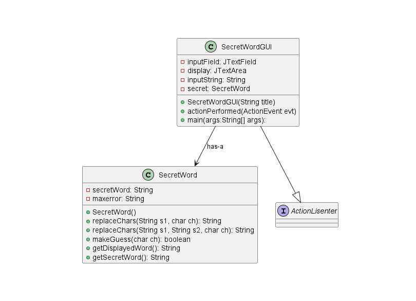
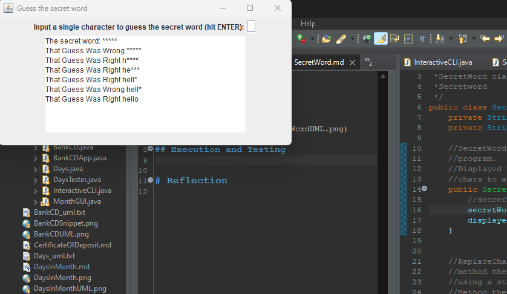

# SecretWord report
Author: Braden Tink

## UML class diagram

## Execution and Testing

# Reflection
I found the this assignment helped better understand the use of private variables. Having them set to private in the class an using methods to get the values instead of having them public. 

The use of loops in this assignment was hard to grasp at the start as you were using the indices of a string builder as part of your loop. However after the assignment I feel more comfortable with multiple methods and accessing variables using getters.  