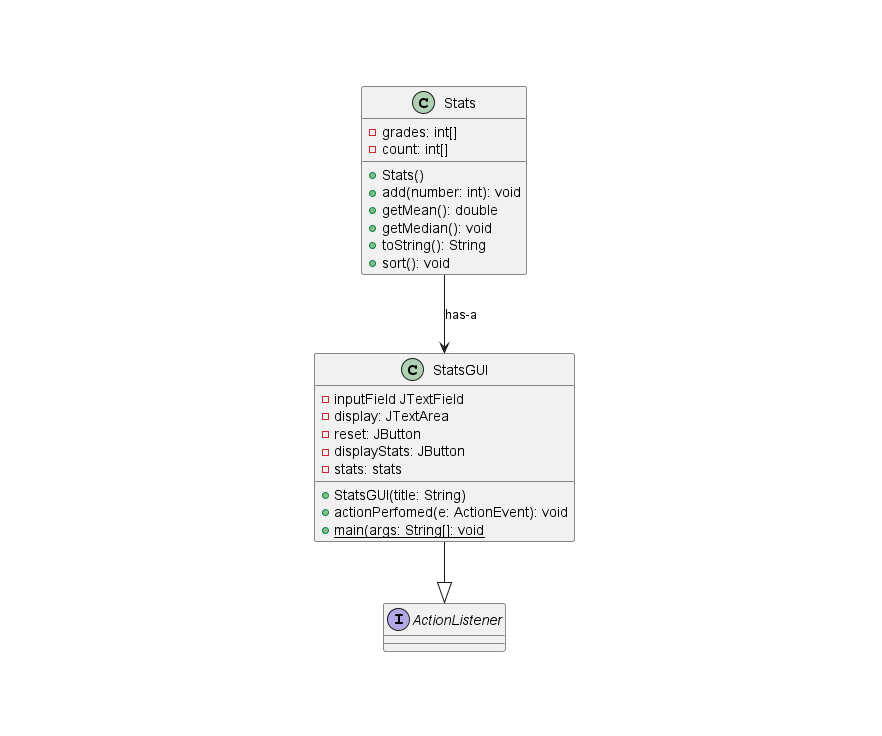
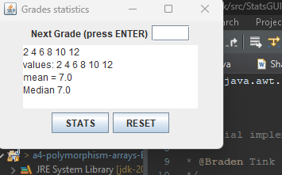
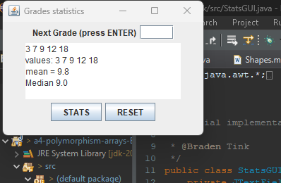

# Stats report
Author: Braden Tink

## UML class diagram

## Execution and Testing
Results even use case

Results odd use case 

# Reflection
I found the assignment a good refresher on arrays as it felt more natural coding this poart of the assignemnt. Where as the Shapes part was more trail and error playing with extended and abstract methods.
However the relationship used betwen points and shapes gave a good visual repersentation for this topic. I defiently thing having a simple use case like this makes the learning of these complex realtionships easier. 