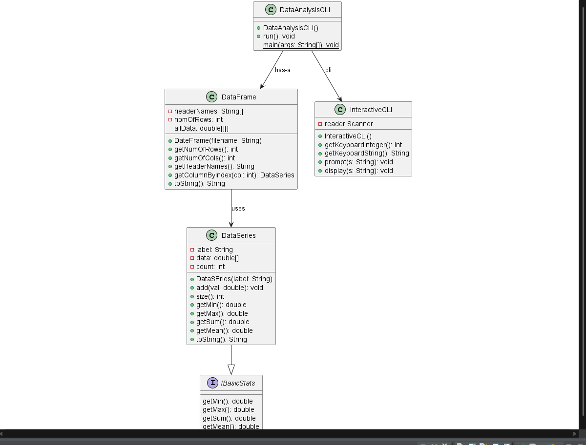
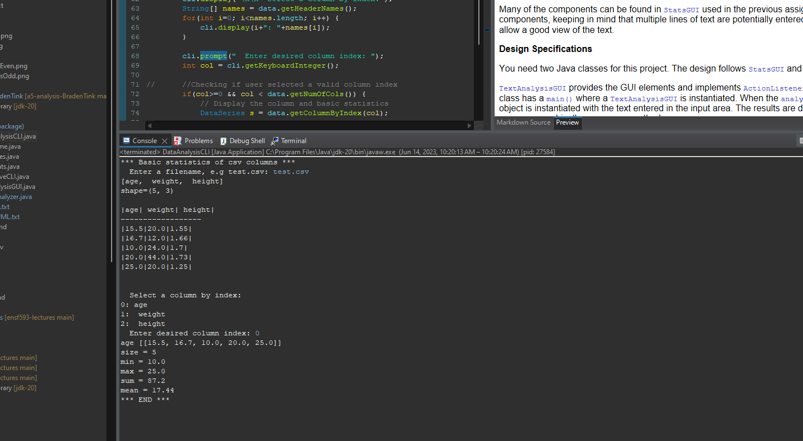
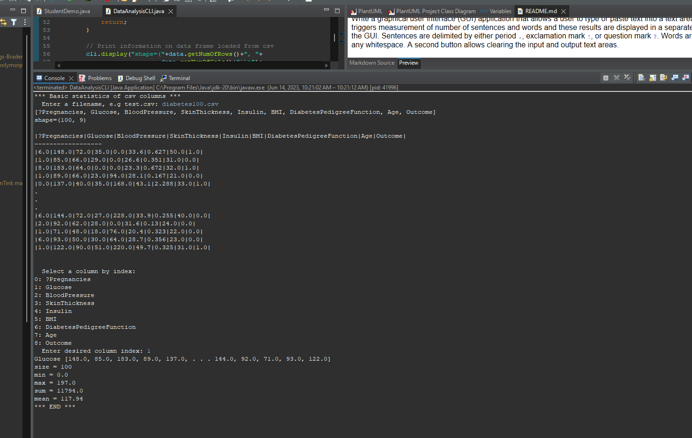
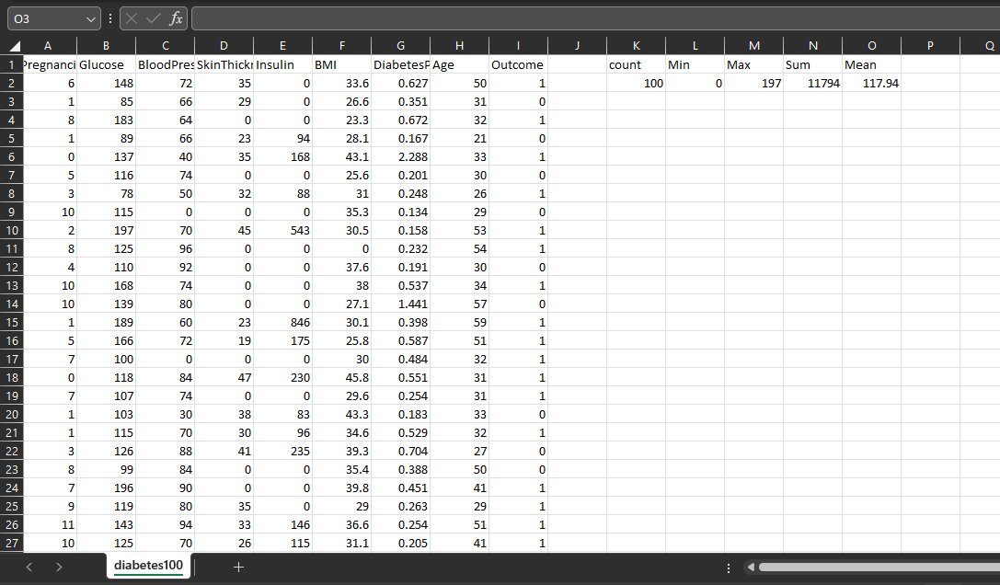

# Data Analysis report
Author: 

## UML class diagram

## Execution and Testing

## Verification of statistics

For the verification I used excel. I created a count, min, max, sum and mean column then used the built in function to get count, min, max, sum. For mean i took the sum divided by the count.

# Reflection
Found this assigment really helped cement interfaces with the data section. Felt the linking of class finally came together. One part of the data assignment that was harder was populating the 2D array. 

For the text analysis was a shorter program but hard to truly understand was was happening when you performed the string actions. Knowing the splits to perform and the edit to the string using the trim. 
